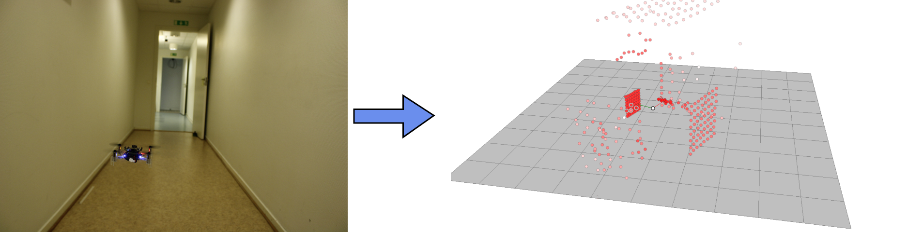
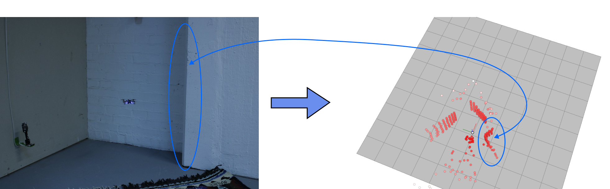

# Slamdeck
This repository contains the source code that has developed during my bachelor's thesis. In this thesis I investigate the possibility of creating a prototype circuit board with multiple simultaneous multizone solid-state lidars and an on-board microcontroller. The circuit board is designed to be mounted on the [Crazyflie](https://www.bitcraze.io/products/crazyflie-2-1/).

The project was successful and a circuit board was built, that could collect data from all sensors and send it to a ground control station.

---

## The prototype
The on-board microcontroller is an [ESP32-S3](https://www.espressif.com/en/products/socs/esp32-s3), which is a dual-core SoC developed by Espressif. It supports both WiFi and BLE, and can be programmed directly through USB with the help of its USB Serial/JTAG Controller.


The solid-state lidar is the [VL53L5CX](https://www.st.com/en/imaging-and-photonics-solutions/vl53l5cx.html) developed by STMicroelectronics. It's a state-of-the art sensor which can measure distances to multiple zones simultaneously, and thus output a 2D matrix of distances. It's configurable to output a matrix of 4x4 or 8x8, and supports a variety of customizable settings such as ranging frequency, number of targets *per* zone, etc.


The following table contains the main components for the protoype:

| Component | Amount | Description |
| --- | --- | --- |
| ESP32-S3 | 1 | On-board microcontroller |
| VL53L5CX | 5 | Multizone solid-state lidar sensor |
| TPS62A01 | 1 | DC-DC converter |
| LED | 3 | LEDs can always be useful. For instance, they can indicate the state of the microcontroller. |
| Button | 1 | Used to enter boot mode or as normal GPIO |
| Micro-USB connection | 1 | Used to program the ESP32-S3 |
| DS28E05R | 1 | 1-Wire EEPROM, used by the Crazyflie to identify the deck |
Resistors, capacitors & inductors | x | Necessary for the rest of the components to work correctly. |

The schematic for the main PCB board can be found [here](schematics/slamdeck-main.pdf) and the schematic for the "satellite" board (the small PCB with the sensor) can be found [here](schematics/slamdeck-satellite.pdf).


---

## Build Instructions

### Firmware - ESP32-S3
The firmware written in C and is built with [ESP-IDF](https://docs.espressif.com/projects/esp-idf/en/release-v4.4/esp32s3/index.html) as of version 4.4. You can build the firmware through the cli, with a custom install of `ESP-IDF`, or you can use Espressifs VS Code extension. Instructions can be found [here](https://docs.espressif.com/projects/esp-idf/en/latest/esp32s3/get-started/index.html#installation) to set up your build system.

#### Build through CLI
Ensure that your esp-idf environment is activated, then run the following from the root of this repository:
```
idf.py set-target esp32-s3
idf.py build
```

To flash:
`idf.py -p (PORT) flash'`

To monitor the UART:
`idf.py monitor -p (PORT)`

### Firmware - Crazyflie
The firmware of the Crazyflie had to be extended to support the deck, which was done by a fork of the original firmware. This is added as a submodule `crazyflie-firmware-slamdeck` and can be updated by:

```
git submodule init
git submodule update
```

Then, to build the firmware run:

```
cd crazyflie-firmware-slamdeck
make menuconfig
```

Then, to enable the deck driver, select:
- Build and debug options `--->` Enabled debug build `[*]`
- Expansion deck configuration `--->` Force load specified custom deck driver: `bcSLAM`

Then build it:

`make`

Finally, put the Crazyflie in bootloader mode and flash it:

`make cload`


### GUI
The GUI is written in Python with PyQt. To run the GUI it is recommended to first create a virtual environment. Once this is done it can be installed by the following:

```
pip install -r requirements.txt.
gui/main.py
```

---
Below are some images of the 3D visualization in the GUI.




